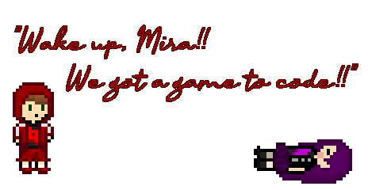

# P/E/T/S (Rewritten)

[JUST LET ME PLAY THE DAMN GAME!](/just-start-the-damn-game.md)

Rewriting my game I started back in 2019, except actually finishing it this time
because I picked a good game engine that doesn't make basic programming and
control of your own hardware overly complicated... and is also open-source! <3

---

## A Note About The Soundtrack...

Took down the old YT playlist link, but it's still in git history if you really care.
That's because a lot of the tracks were outdated, as I was too lazy to keep reuploading
them to YouTube after every single minor edit. Someday, I'll be releasing tracks officially
through DistroKid, so they'll show up on YouTube, Spotify, Apple Music, blah blah blah etc.
alongside all my other stuff. Until then, the most recent publicly available music will be
whatever I felt like pushing to this repo for testing purposes. Sorry to the 0 people who care.

---

On Godot version 4.6.1

Using [godot-rust/gdext](https://github.com/godot-rust/gdextension) for most of
the stuff, because of the type system. Prefer GDScript for things that probably
won't need to interact with Rust code, and are simpler to just write as GDScript
scripts (for example, enemy attack patterns or NPC dialogue).

---

This game is... well, obviously... free and open-source software! Yay! 🎉

Many of my favorite games are either entirely free (no microtransactions) OR
open-source / respect your digital freedoms. Be the change you wish to see in
the world, right?

---

## Contributing

Confused? Read the [SOPs](pets-lib/sop/index.md) for some instructions on common tasks.
If you can't find what you're looking for there, open a ticket and I'll be happy
to help you out and add an entry for future reference.
